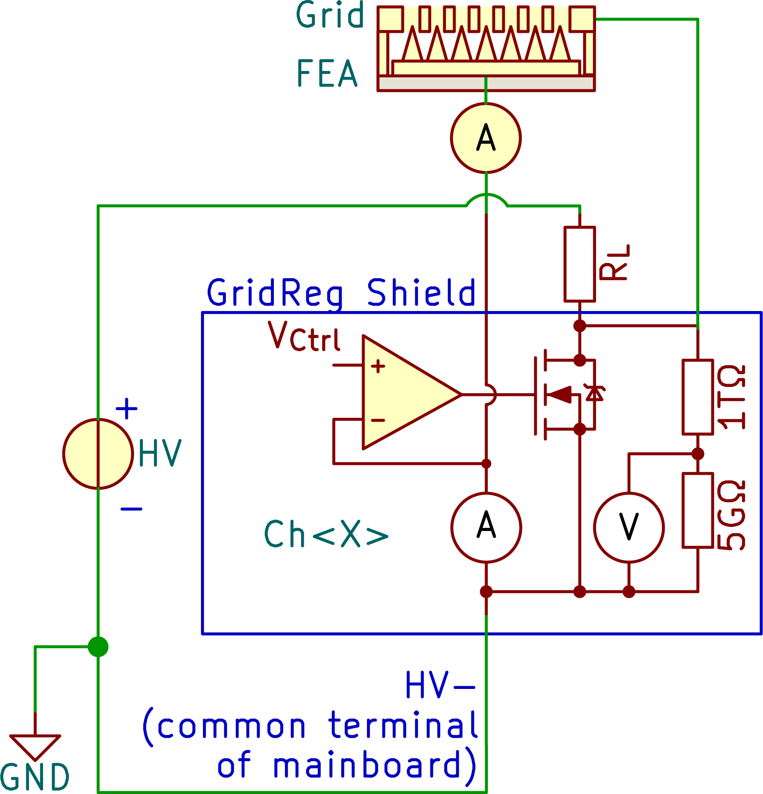

# FEAR-Grid Regulation
This repository contains the KiCAD-design files for a shield of the F(ield) E(mission) A(rray) R(egulation) current control circuit.

**Note:** This project is part of the SubModule-repository [FE-FEAR16v2][FE-FEAR16v2-SubmoduleRepo], where you can find sub-repositories for other shield-PCBs, mainboard-PCB and the firmware.

# Description
The name "grid regulation" comes from the original main purpose of regulating the potential of the extraction grid (extraction voltage) of a field emission array (FEA = cathode) based on the current through the cathode. However, it can be used in all cases where a potential needs to be regulation (Grid-input) based on the current-flow through the device under test which can be connected on a separate measurement-input (FEA-input). During active regulation this shield acts like a current-source/-sink.

- The shield itself takes 1 DAC-output voltage (V~Ctrl~ = 0..10V) to adjust the current control.
- The A(mperemeter) is actually a shunt-resistor which defines the measurable current range. A 1MΩ for instance yields a range from 0.31 nA (resolution) to 10 µA, whereby its wisely to keep the current slightly below as 10 µA is the absolute maximum measurable value.
- The V(oltmeter) measures the internal voltage-drop over the FET.

**Note:** Both, A and V use potentiometers to adjust their feedback-loop amplification. Due to tolerances on all the parts, its recommended to use a shield only at a specific mainboard and a specific channel-position at which the boards were calibrated.

**Principle of the cathode regulation:**

# HowTo to connect (samples and for calibration)
1. Place a shield on a mainboard/channel-slot.

2. Calibration: continue with step 3., otherwise go to 5.

3. Calibrate V~Shnt~ (FEA-Input)

    1. Connect the positive supply of a voltage source (needs to supply voltages up to 10V) to the FEA-input via an amperemeter (see figure above) and the negative supply (GND) to the HV- input. Note that amperemeter for fine-tuning the V~Shnt~ measurement (FEA-Input) is located between FEA-Input and FEA for circuitry reasons. As over the GridReg-Shield a voltage-drop occurs (up to 10V), the amperemeter needs to be able to withstand a few volts between measurement input and earth.

    2. Apply a voltage to the input (e.g. 9V).

    3. Adjust the current gain potentiometer, so that the measured ADC value divided by the shunt-resistance is equal to the amperemeter-value (V~Shnt~/R~Shunt~ = I~Amperemeter~)

4. Calibrate V~Drp~ (Grid-Input)

    1. Make sure, the FEA-Input connection of 3.i. above was made.

    2. Connect a high voltage-supply (via a Load-Resistor R~L~) to the Grid-Supply-Input (for further explanations see note below) and apply a high voltage (e.g. 1kV).

    3. Adjust the FEA-input voltage of 3.ii., so that the NFET blocks the current flow (Grid-Potential should increase to 1kV). If the FEA-Input voltage has to be higher or lower than V~Ctrl~ depends if you use the additional inverter-option which can be connected to the NFET-gate on the PCB.

    4. Adjust the voltage-drop gain potentiometer. The board projects a voltage range of &pm;1500V into a range of &pm;10V using a voltage divider with huge resistance values. Example for positive voltage:
    1500V * 5GΩ / 1005GΩ * Gain = 7.462..V * Gain = 10V
    Gain = 10V / 7.462..V = 1.34

5. Connect your FEA on the shield's FEA-Input screw terminal, the extraction grid to the the most negative supply to to HV- (which is the mainboard's common-terminal).

**Note:**
- The load-resistor R~L~ is a simple approach of increasing the voltage on the Grid-Input. This is because the high voltage of up to 1500V makes a  performant half-bridge design (regulated PFET instead of R~L~) tricky to realize. Its also noteworthy that R~L~ creates an asymmetric time-behaviour in charging and discharging the voltage of the extraction grid, and depends on the speeds your applications require.
- The FEAR command-documentation can be found in the firmware-repository (see [FE-FEAR16v2 Submodule-Repo][FE-FEAR16v2-SubmoduleRepo]).

[FE-FEAR16v2-SubmoduleRepo]: https://github.com/Dephrilibrium/FE-FEAR16v2